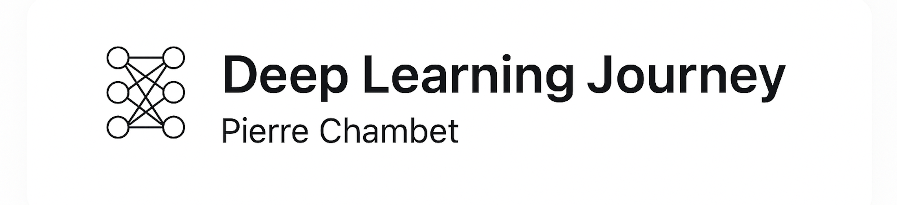

<p align="center">
  
</p>

<h1 align="center">Deep Learning from Scratch</h1>
<p align="center">
  <a href="https://github.com/Pchambet/Deep-Learning-from-Scratch/actions/workflows/ci.yml">
    
  </a>
</p>
<p align="center">
  From first principles to real images — one neuron, one layer, one insight at a time.<br>
  <em>Part of <strong>WIL</strong> — Wide-Range Ideas Laboratory</em><br>
  <a href="https://www.linkedin.com/in/pierre-chambet-289a5b220/">LinkedIn</a> ·
  <a href="https://github.com/Pchambet">GitHub</a>
</p>

---

> “Don't just run `.fit()`. Build the thing, understand it, and then trust it.”

---

## About

I'm **Pierre Chambet**, a data and deep learning engineer-in-the-making who decided to rebuild deep learning from scratch — not by copying frameworks, but by understanding every equation, line, and gradient.

This repo is a **learning-in-public lab**. It documents the full path from a hand-coded neuron in NumPy to a convolutional network on MNIST — explained, derived, and visualized with care. It's both a portfolio of understanding and a teaching resource: math → code → intuition → result.

---

## Where to begin

This repository holds two things: a **course** (a clear path from neuron to CNN) and a **lab** (a space to explore). Both live under the same roof — pick the door that fits your mood.

---

## Two ways in

|  | **Course** | **Lab** |
| -- | ------------ | --------- |
| **For** | Learning, following a clear path | Exploring, experimenting, going deeper |
| **Format** | PDF episodes + notebooks, step by step | Case studies, scripts, open-ended play |
| **Start here** | [Ep. I](#linkedin-series-3-episodes) or [birth_of_a_neuron](notebooks/birth_of_a_neuron.ipynb) | [lab/mnist](lab/mnist/) or [lab/cnn](lab/cnn/) |

---

## Course — The main path

A guided journey: **theory → gradients → code**. One episode at a time. No rush. No fluff.

### LinkedIn Series (5 episodes)

| Episode | Title | What you get | Link |
| :-------: | ------ | -------------- | ------ |
| **I** | *Theory of a Neuron* | 10-page PDF — linear function, sigmoid, log-loss | [PDF](pdf/Theory%20of%20a%20Neuron.pdf) |
| **II** | *The Art of Descent* | 12-page PDF — chain rule, ∂ℓ/∂w, ∂ℓ/∂b | [PDF](pdf/The%20Art%20of%20Descent.pdf) · [Notebook](notebooks/02_gradients_single_neuron.ipynb) |
| **III** | *Birth of a Neuron* | 18-page PDF + Colab — neuron coded by hand | [PDF](pdf/Birth%20of%20a%20Neuron.pdf) · [Colab](https://colab.research.google.com/github/Pchambet/Deep-Learning-from-Scratch/blob/main/notebooks/birth_of_a_neuron.ipynb) |
| **IV** | *All Eyes on You* | Training loop on real images (cats vs dogs) | [PDF](pdf/All%20Eyes%20on%20You.pdf) |
| **V** | *The Rise of Intelligence* | 25-page PDF — full neural network theory, forward & backprop | [PDF](pdf/The%20Rise%20of%20Intelligence.pdf) |
| **VI** | *Alive* | 18-page PDF + Colab — 2-layer network coded from scratch | [PDF](pdf/Alive.pdf) · [Colab](https://colab.research.google.com/github/Pchambet/Deep-Learning-from-Scratch/blob/main/notebooks/06_alive.ipynb) |
| **VII** | *Horizon of Depth* | 16-page PDF + Colab — generalized L-layer network | [PDF](pdf/Horizon%20of%20Depth.pdf) · [Colab](https://colab.research.google.com/github/Pchambet/Deep-Learning-from-Scratch/blob/main/notebooks/07_horizon_of_depth.ipynb) |

> Reply with **NEURON** (Ep. I), **GRADIENT** (Ep. II), **BIRTH** (Ep. III), or **RISE** (Ep. V) on the LinkedIn posts to receive the PDF via DM.
> #DeepLearningJourney

### Course notebooks

| # | Notebook | Focus | Tied to |
| :-: | ---------- | ------- | --------- |
| — | **birth_of_a_neuron** | Neuron coded by hand (toxic plants) | Ep. III · Colab |
| 01 | **Single Neuron** | Linear model, sigmoid | Ep. I theme |
| 02 | **Gradients Single Neuron** | ∂L/∂w, ∂L/∂b, chain rule | Ep. II |
| 04 | **Training Loop** | Forward → loss → backward → update (cats vs dogs) | — |
| 05 | **From One Neuron to a Brain** | First 2-layer ANN from scratch (nonlinear boundary) | Ep. V |
| 06 | **Alive** | 2-layer network from scratch (circles + cats vs dogs) | Ep. VI · [Colab](https://colab.research.google.com/github/Pchambet/Deep-Learning-from-Scratch/blob/main/notebooks/06_alive.ipynb) |
| 07 | **Horizon of Depth** | L-layer network (circles, moons, spirals, cats vs dogs) | Ep. VII · [Colab](https://colab.research.google.com/github/Pchambet/Deep-Learning-from-Scratch/blob/main/notebooks/07_horizon_of_depth.ipynb) |
| 08 | **Two-Layer Network** | 2-layer network on images | — |
| 11 | **MNIST MLP Baseline** | Dense network on MNIST | — |
| 12 | **MNIST CNN Baseline** | CNN, feature maps | — |

### Extended guides (PDF)

| File | Theme |
| ------ | -------- |
| [main.pdf](pdf/main.pdf) | Full picture — neurons to the training loop |
| [mnist.pdf](pdf/mnist.pdf) | Dense networks on MNIST |
| [CNN.pdf](pdf/CNN.pdf) | Understanding convolutions |

---

## Lab — Go further

Where the course leaves off, the Lab begins. Case studies, scripts, experiments — room to breathe, break things, and learn by doing.

👉 **[Enter the Lab](lab/README.md)**

| Project | What's inside |
| ------- | --------------- |
| [**MNIST Case Study**](lab/mnist/) | Full MLP pipeline — normalization, training curves, evaluation |
| [**CNN Case Study**](lab/cnn/) | Convolutions on MNIST — filters, pooling, architecture |

---

## Quickstart

```bash
git clone https://github.com/Pchambet/Deep-Learning-from-Scratch.git
cd Deep-Learning-from-Scratch
python -m venv .venv && source .venv/bin/activate  # Windows: .venv\Scripts\activate
pip install -r requirements.txt
jupyter lab notebooks/birth_of_a_neuron.ipynb
```

### Python compatibility

- **Core notebooks and scripts:** Python **3.10+**
- **TensorFlow notebooks/scripts (MNIST/CNN):** Python **3.10–3.12** recommended
- If you are on macOS Apple Silicon, install from `requirements.txt` (includes `tensorflow-macos` + `tensorflow-metal` markers)

### Quality checks

```bash
make quality          # compile + pytest + smoke test
make test             # run pytest (utilities, two_layer, birth_of_a_neuron)
make precommit        # run formatting/lint hooks
make episode5-demo    # run Episode V demo (make_circles)
```

Optional one-time setup:

```bash
pip install pre-commit
pre-commit install
```

**No install needed:** [Colab — birth_of_a_neuron](https://colab.research.google.com/github/Pchambet/Deep-Learning-from-Scratch/blob/main/notebooks/birth_of_a_neuron.ipynb)

---

## Repository structure

```
Deep-Learning-from-Scratch/
├── notebooks/           # Course — birth_of_a_neuron, 01, 02, 04–08, 11, 12
├── tests/               # pytest — utilities, two_layer_network, birth_of_a_neuron
├── pdf/                 # Built guides (Ep. I–III, main, mnist, CNN)
├── latex/               # LaTeX sources — main, mnist, cnn (edit here, build → pdf/)
├── lab/                 # Lab — case studies
│   ├── mnist/           # MNIST MLP (notebook + train_mlp.py)
│   └── cnn/             # CNN (notebook + train_cnn.py)
├── src/                 # utilities.py (load_data for HDF5)
├── data/                # trainset.hdf5, testset.hdf5 (cats vs dogs)
├── assets/              # Figures, banners, photos
├── Makefile             # make latex → build all PDFs
├── requirements.txt
└── README.md
```

---

## Philosophy

> "Learning isn't remembering — it's rebuilding."

No black boxes. Every weight, every gradient, every update — traced and understood. That's the point.

---

## For recruiters

**In five minutes**, this repo shows that I:
- Understand the math behind neural networks
- Implement and debug deep learning models end-to-end
- Communicate complex ideas clearly and visually
- Learn independently, structure my work, and deliver clean results

**Suggested entry points:**
- [birth_of_a_neuron.ipynb](notebooks/birth_of_a_neuron.ipynb) — clarity
- [02_gradients_single_neuron.ipynb](notebooks/02_gradients_single_neuron.ipynb) — theory
- [11_mnist_mlp_baseline.ipynb](notebooks/11_mnist_mlp_baseline.ipynb) — application
- [12_mnist_cnn_baseline.ipynb](notebooks/12_mnist_cnn_baseline.ipynb) — maturity

---

## Contribute / Connect

Found an error or an idea worth exploring? Open an issue or a PR.
Learning in public too? Let's connect.

<p align="center">
  <a href="https://www.linkedin.com/in/pierre-chambet-289a5b220/">
    
  </a>
  <a href="https://github.com/Pchambet">
    
  </a>
</p>

---

<p align="center"><i>
Deep Learning from Scratch — built with patience, mathematics, and curiosity.<br>
Part of WIL™ — Wide-Range Ideas Laboratory · © 2025 Pierre Chambet
</i></p>
