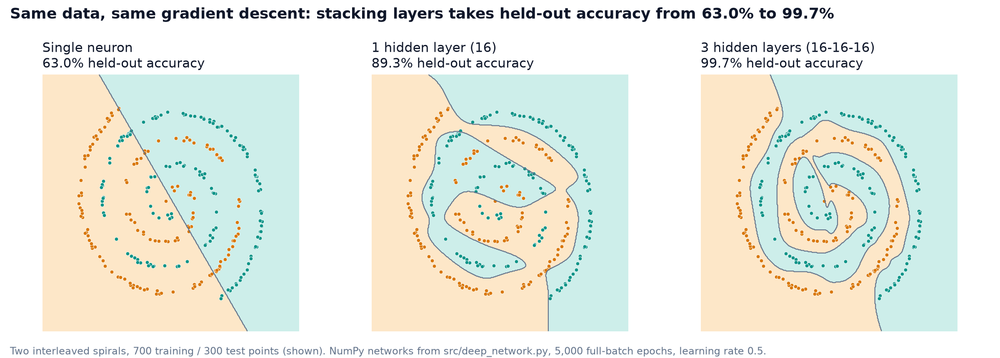
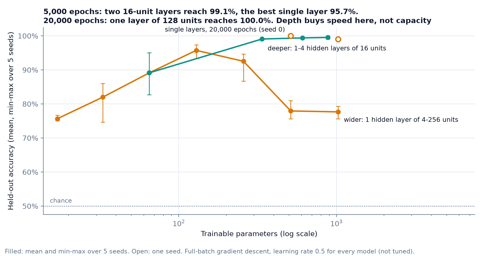
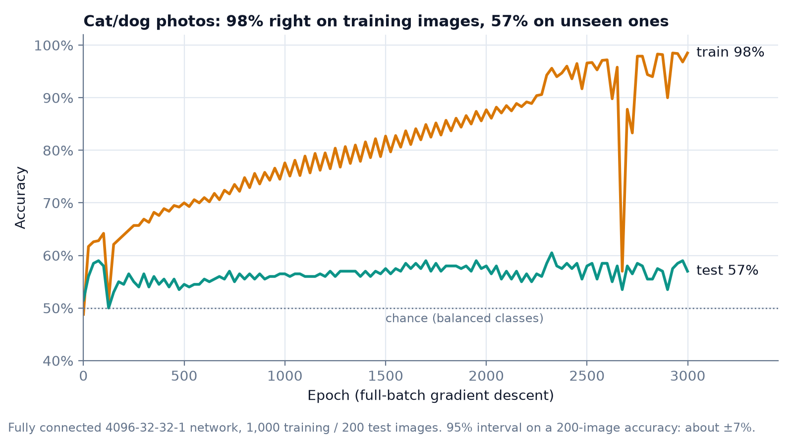

# Deep-Learning-from-Scratch

Neural networks rebuilt from first principles in NumPy, from one neuron to any depth:
every gradient derived on paper, coded by hand, and checked against finite differences.

[](https://github.com/Pchambet/Deep-Learning-from-Scratch/actions/workflows/ci.yml)

[](LICENSE)



## TL;DR

- **The maths is verified, not assumed.** Back-propagation in [`src/deep_network.py`](src/deep_network.py)
  matches central finite differences to a relative error of at most 3.1 × 10⁻⁷ at depths 1 to 4,
  for tanh and sigmoid hidden units. CI re-checks it on every push, along with the agreement of
  the L-layer code with the single neuron of Episode III and the two-layer network of Episode VI.
- **Hidden layers bend the boundary.** On two interleaved spirals (300 held-out points), the
  same 5,000 epochs of gradient descent take accuracy from 63.0% for a single neuron to 89.3%
  with one hidden layer of 16 units (65 parameters) and 99.7% with three (609 parameters).
- **Depth buys training speed here, not capacity.** In those 5,000 epochs two layers of 16
  units reach 99.1% over five seeds (337 parameters, worst seed 98.7%), while no single hidden
  layer beats 95.7% (32 units); at 128 and 256 units, with as many parameters as the deep
  models, it falls to about 78%. Trained four times longer, a single layer of 128 units reaches
  100% (one seed): the wide layers had not finished learning, they were not too small.
- **The honest limit.** On 64 × 64 cat/dog photos a fully connected 4096-32-32-1 network gets
  98.5% of its training images right and 57.0% of unseen ones (±6.9 points, 95% interval on 200
  images): it memorises. A small Keras CNN on MNIST makes a third of the errors of a dense
  network (111 vs 359 out of 10,000), which is why convolutions come next.
- **Seven episodes and a 117-page guide** as PDFs; all but Episodes I–III rebuild
  byte-identically from their LaTeX sources with `make latex`.

## Why it matters

Frameworks make training a network one call to `.fit()`. When that call misbehaves (a loss
that will not move, a model that is perfect on training data and useless after), the person
who has derived and coded back-propagation by hand knows where to look. This repository is
that derivation, written as a course: each step is small enough to check, and each claim
about what a network can or cannot do is backed by a run you can repeat.

## Approach

The course was first published as a LinkedIn series. Each episode pairs a PDF (theory,
derivations, figures) with a notebook (the same ideas in code).

| Episode | PDF | Notebook | What you build |
| :-: | --- | --- | --- |
| I | [Theory of a Neuron](pdf/Theory%20of%20a%20Neuron.pdf) (10 p.) | [`01_single_neuron`](notebooks/01_single_neuron.ipynb) | Linear model, sigmoid, log-loss |
| II | [The Art of Descent](pdf/The%20Art%20of%20Descent.pdf) (12 p.) | [`02_gradients_single_neuron`](notebooks/02_gradients_single_neuron.ipynb) | Chain rule, ∂L/∂w and ∂L/∂b, gradient descent |
| III | [Birth of a Neuron](pdf/Birth%20of%20a%20Neuron.pdf) (18 p.) | [`birth_of_a_neuron`](notebooks/birth_of_a_neuron.ipynb) · [Colab](https://colab.research.google.com/github/Pchambet/Deep-Learning-from-Scratch/blob/main/notebooks/birth_of_a_neuron.ipynb) | The neuron coded by hand |
| IV | [All Eyes on You](pdf/All%20Eyes%20on%20You.pdf) (9 p.) | [`04_training_loop_from_scratch`](notebooks/04_training_loop_from_scratch.ipynb) · [Colab](https://colab.research.google.com/github/Pchambet/Deep-Learning-from-Scratch/blob/main/notebooks/04_training_loop_from_scratch.ipynb) | Training loop on real images, train/test split |
| V | [The Rise of Intelligence](pdf/The%20Rise%20of%20Intelligence.pdf) (26 p.) | [`05_from_neuron_to_brain`](notebooks/05_from_neuron_to_brain.ipynb) · [Colab](https://colab.research.google.com/github/Pchambet/Deep-Learning-from-Scratch/blob/main/notebooks/05_from_neuron_to_brain.ipynb) | Two-layer network: forward and backward pass |
| VI | [Alive](pdf/Alive.pdf) (20 p.) | [`06_alive`](notebooks/06_alive.ipynb) · [Colab](https://colab.research.google.com/github/Pchambet/Deep-Learning-from-Scratch/blob/main/notebooks/06_alive.ipynb) | Two-layer network in code; first overfitting |
| VII | [Horizon of Depth](pdf/Horizon%20of%20Depth.pdf) (18 p.) | [`07_horizon_of_depth`](notebooks/07_horizon_of_depth.ipynb) · [Colab](https://colab.research.google.com/github/Pchambet/Deep-Learning-from-Scratch/blob/main/notebooks/07_horizon_of_depth.ipynb) | Any number of layers, written with loops |

Going further:

- [**The long guide**](pdf/main.pdf) (117 p.) covers the same path in one document; its deep
  dives are notebooks [`08_two_layer_gradients`](notebooks/08_two_layer_gradients.ipynb)
  (derivation), [`09_two_layer_network`](notebooks/09_two_layer_network.ipynb) and
  [`10_backprop_any_depth`](notebooks/10_backprop_any_depth.ipynb).
- **Guides** on [dense networks for MNIST](pdf/mnist.pdf) and [convolutions](pdf/CNN.pdf), with
  their Keras baselines in [`lab/`](lab/).
- **The tested code**: [`src/deep_network.py`](src/deep_network.py) (L layers),
  [`src/two_layer_network.py`](src/two_layer_network.py) (Episode VI),
  [`notebooks/birth_of_a_neuron.py`](notebooks/birth_of_a_neuron.py) (Episode III) and
  [`src/gradient_check.py`](src/gradient_check.py).


```mermaid
flowchart LR
    A["Derive<br/>PDF episodes"] --> B["Code it in NumPy<br/>notebooks, src/"]
    B --> C["Check it<br/>finite differences, pytest"]
    C --> D["Measure it<br/>held-out data, seeds"]
    D --> E["Find the limit<br/>images need convolutions"]
```

## Results

All numbers below come from `make figures` ([`scripts/make_figures.py`](scripts/make_figures.py)),
which writes [`docs/results.json`](docs/results.json); the run is deterministic.

**Width versus depth.** Five seeds per architecture, same data, learning rate (0.5) and
5,000 epochs. Within that budget a second 16-unit layer solves the spirals, while a single
layer peaks at 32 units and gets worse beyond. The single layers of 128 and 256 units span the
same parameter range as the deep models, so parameter count does not explain the gap; training
them 20,000 epochs closes it. With plain gradient descent and a fixed budget, depth made the
spirals faster to learn; it was not needed to represent them, as the universal approximation
theorem predicts for a single hidden layer.



| Hidden layer widths | Parameters | Epochs | Held-out accuracy, mean (min–max over 5 seeds) |
| --- | ---: | ---: | --- |
| 16 | 65 | 5,000 | 89.1% (82.7–95.0) |
| 32 | 129 | 5,000 | 95.7% (93.3–97.3) |
| 64 | 257 | 5,000 | 92.5% (86.7–94.7) |
| 128 | 513 | 5,000 | 77.9% (75.7–81.0) |
| 256 | 1,025 | 5,000 | 77.7% (75.7–79.3) |
| 16-16 | 337 | 5,000 | 99.1% (98.7–99.3) |
| 16-16-16 | 609 | 5,000 | 99.4% (99.0–99.7) |
| 16-16-16-16 | 881 | 5,000 | 99.5% (99.0–100.0) |
| 128 | 513 | 20,000 | 100.0% (seed 0 only) |
| 256 | 1,025 | 20,000 | 99.0% (seed 0 only) |

**Where fully connected networks stop.** Trained on the 1,000 cat/dog images of Episodes IV–VII,
the network drives training accuracy to 98.5% while test accuracy hovers between 50% and 60.5%
and ends at 57.0%. The losses tell the same story: training log-loss falls to 0.09 while test
log-loss rises from about 0.7 (a coin flip scores ln 2 ≈ 0.69) to 1.00, so the gap is memorisation, not a failure to
optimise. A flattened image throws away which pixels are neighbours. Episode VI's notebook
shows the same thing with two layers (97.4% train, 52.0% test).



**What convolutions buy** (Keras baselines in [`lab/`](lab/), MNIST test set of 10,000 digits):

| Model | Test accuracy | Errors |
| --- | ---: | ---: |
| Dense 784-128-64-10 ([notebook](lab/mnist/mnist.ipynb)) | 96.4% | 359 |
| Two conv + pooling blocks, dense head ([notebook](lab/cnn/CNN.ipynb)) | 98.9% | 111 |

## Reproduce

```bash
git clone https://github.com/Pchambet/Deep-Learning-from-Scratch.git
cd Deep-Learning-from-Scratch
make setup     # uv sync --locked: Python 3.12 environment from uv.lock
make check     # ruff, 37 tests including gradient checks, smoke test, Episode V demo (~20 s)
make figures   # the experiments above, deterministic (~5 min on a laptop CPU)
make latex     # rebuild every PDF from LaTeX (needs latexmk + TeX Live, ~1 min)
```

Notebooks: `uv run jupyter lab`, or open any Colab link above (no install needed).
Keras baselines: `make lab` (installs TensorFlow, downloads MNIST). The checked-out files take
35 MB; the environment without TensorFlow about 450 MB.

## Repository layout

```text
notebooks/   course notebooks 01-10; Episode III is birth_of_a_neuron.ipynb (name kept for
             the links in its PDF) and birth_of_a_neuron.py holds its functions
src/         deep_network.py, two_layer_network.py, gradient_check.py, utilities.py
tests/       pytest: shapes, gradient checks, cross-episode agreement, known boundaries
scripts/     make_figures.py (README experiments), smoke_test.py, episode_05_demo.py
docs/        figures/*.png and results.json written by make figures
pdf/         published guides (Episodes I-VII, long guide, MNIST, CNN)
latex/       LaTeX sources of every guide except Episodes I-III
lab/         Keras baselines on MNIST (dense, CNN)
data/        64x64 cat/dog HDF5 files (1,000 train / 200 test), see data/README.md
assets/      images used by the guides and notebooks
```

## Methodology notes and limitations

- **Spiral experiments** use one fixed 700/300 split; seeds change the initial weights only.
  Learning rate (0.5) and epochs (5,000) are the same for every architecture and were not tuned
  per model. The drop of the single layers beyond 32 units is an optimisation effect, as the
  20,000-epoch runs show; those longer runs use one seed only.
- **Cat/dog training is at the edge of stability**: with learning rate 0.02 the training
  accuracy zig-zags throughout and collapses once, to 57% around epoch 2,675, before recovering.
  The final numbers are taken after the recovery.
- **Cat/dog test set**: 200 images, so any accuracy carries about ±7 points of sampling error.
  The figure reports the last epoch; the best test accuracy seen during training (60.5%) is not
  reported as a result because picking it would use the test set for model selection.
- **No validation set, no regularisation, full-batch gradient descent.** These are teaching
  networks: the point is to see each mechanism, not to reach the state of the art.
- The **Keras MNIST dense baseline** (96.4%) is the saved output of its notebook and was not
  re-run for this version; the CNN notebook was executed for it. Notebooks 05 and 06 were
  re-executed; the other notebooks keep the outputs of earlier runs.
- The **cat/dog images** are a small teaching set whose original source and licence are not
  recorded in this repository (see [`data/README.md`](data/README.md)).
- The **LaTeX sources of Episodes I–III** are not in the repository; those three PDFs are
  published as-is.

## References

- I. Goodfellow, Y. Bengio, A. Courville, *Deep Learning*, MIT Press, 2016, ch. 6
  (feed-forward networks and back-propagation).
- Y. LeCun, L. Bottou, G. B. Orr, K.-R. Müller, "Efficient BackProp", in *Neural Networks:
  Tricks of the Trade*, Springer, 1998 (the 1/√fan-in initialisation used here); see also
  X. Glorot, Y. Bengio, AISTATS 2010, for the variant that also scales by fan-out.
- Y. LeCun, L. Bottou, Y. Bengio, P. Haffner, "Gradient-based learning applied to document
  recognition", Proc. IEEE, 1998 (MNIST, convolutional networks).
- Stanford CS231n course notes, "Gradient checks" (centred differences, relative error).

---

Built by [Pierre Chambet](https://github.com/Pchambet) — decision science for operations under uncertainty.
